# Feature, ViewViewModel ve ViewPresenter Oluşturucu

  

##### Not: Bu sefer dökümantasyonu Türkçe hazırlamak istedim.

### Motivasyon

Herkes güzel ve modüler kod yazmak istiyor ve bunun için çok fazla katman kurup her seferinde aynı kodu yazıyoruz. Bu yüzden gerek şirket projelerinde gerekse kişisel projelerde asıl odaklanmamız gereken yere odaklanamıyoruz. Ve her seferinde aynı sınıflara aynı klasörlere birbirine benzer dosyaları veya klasörleri oluşturuyoruz bu bir yerden sonra sıkıyor. Bu durumun önüne geçmek için **Python** ile bir script yazma kararı verdim.

  

### Neden Python?

Canım öyle istedi

  

### İhtiyaçlar

  

- 1 adet Python 3.6 veya üstü

- 1 adet Unix veya Unix benzeri (linux vb.) işletim sistemi

## Önemli

Script klasör isimlerine ve dosya isimlerine göre davranıyor. Eğer bu scripti kullanmak istiyorsanız deponun içinde paylaştığım **TestMvp** ve **TestMVVM** yapısına uygun şekilde proje geliştiriniz veya scripti kendi yapınıza göre düzenleyiniz

  

# Kullanım

Scripti ([feature_mvp_mvvm_generator](https://github.com/hsmnzaydn/android-clean-feature-creator/tree/master/feature_mvp_mvvm_generator  "feature_mvp_mvvm_generator")) projenin ana dizinine atınız. Örn: 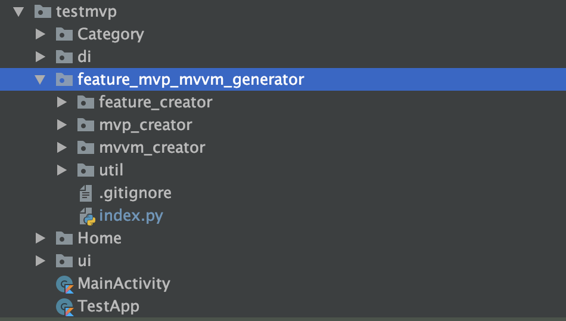

Sonra **index.py** dosyasının içindeki **basePackage** değişkenine kendi projenizin package ismini vermeniz gerekmekte.
  

## . Feature Oluşturmak İçin

Script size Clean Architecture yaklaşımında bir **feature** oluşturur. Bu özelliği kullanabilmek için scriptin içine girip;

  ``` python index.py ```

  yazıp.  Karşınıza gelen seçeneklerden 1'i seçip entera bastıktan sonra oluşturma istediğiniz feature ismini giriniz. 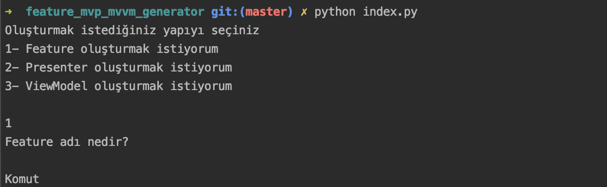

Bunu yaptıktan sonra projenizin dizininde yeni klasörler oluşacak. Onlar şunlar olacak;

- Ana dizinde **feature** adına ait bir klasör oluştu. Onun içinde ise aşağıdaki klasörler oluştu 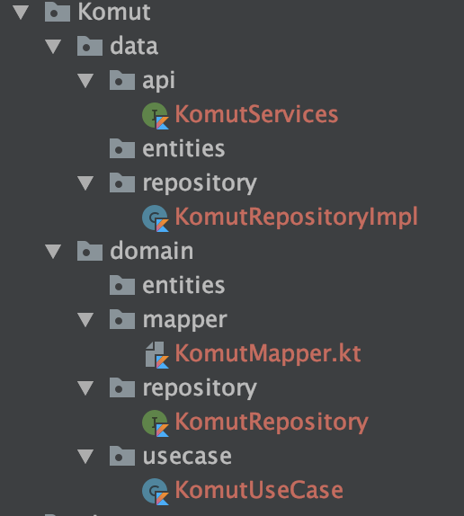
- Dagger 2 için **di** klasörünün içinde bulunan **modules** klasörünün içinde featurınıza ait bir adet modül oluştu. 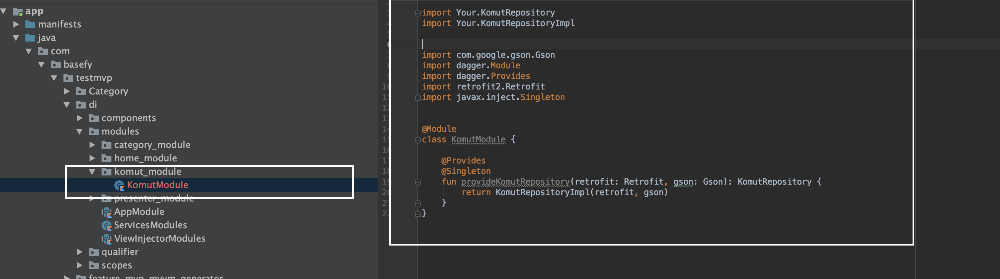
- Bunları yaptıktan sonra sadece feature module(**KomutModule.kt**) sınıfını **Componente** eklemelisiniz 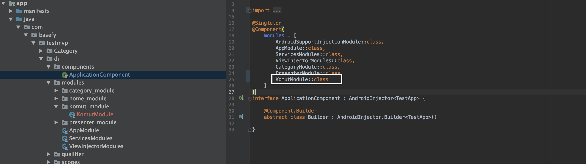

Sadece bunu yaparak kolay bir şekilde projenize dagger 2 ile birlikte modül eklemiş oldunuz.

## . Presenter Oluşturmak

Script dizinine gelip 

  ``` python index.py ```

  yazıp. Karşınıza gelen seçeneklerden 2'i seçip entera bastıktan sonra oluşturma istediğiniz Presenter ismini giriniz. Hemen sonra sizden view(activity, fragment) ismide isteyecek. Onada ismini verin.

  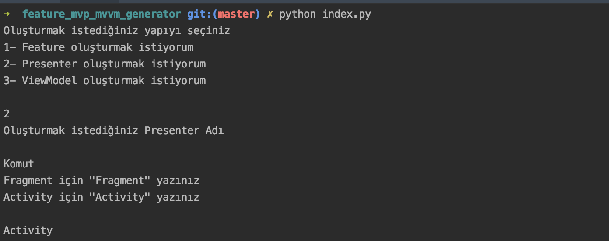

  Bunları yaptıktan sonra **ui** klasörünün içinde verdiğiniz presenter adına ait klasör ve dosyalar olacak 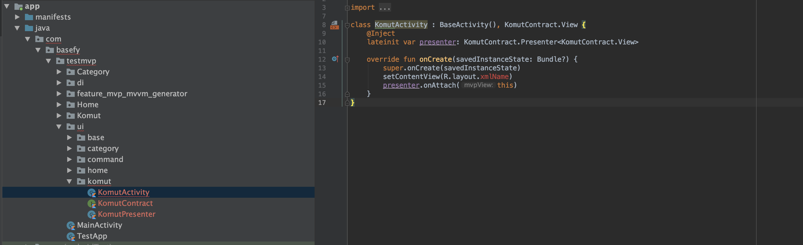
  Script sizin için Activity, Contract ve Presenterı oluşturmuş siz sadece **xmlName** yazan yere layout adınızı vereceksiniz. 

 #### Not: Eğer activity oluşturmuş iseniz MANIFEST dosyasına Activity'inizin ismini vermeyi unutmayınız

 Bunu yaptıktan sonra script sizin için **presenter**ınızı Bind edip birde oluşturdunuz Activity'i Dagger 2'ye veriyor. 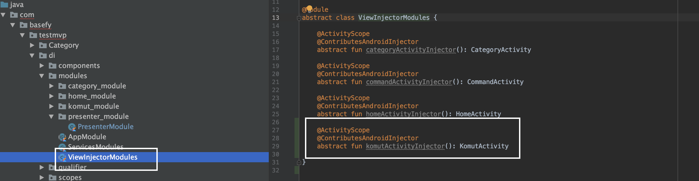

 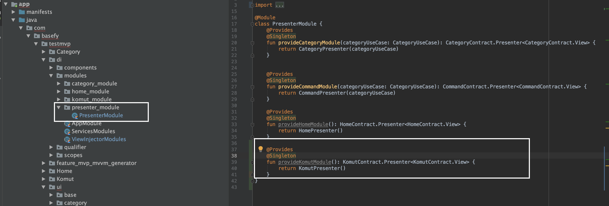

 ## . ViewModel Oluşturmak

 Script dizinine gelip 

  ``` python index.py ```

  yazıp. Karşınıza gelen seçeneklerden 2'i seçip entera bastıktan sonra oluşturma istediğiniz ViewModel ismini giriniz. Hemen sonra sizden view(activity, fragment) ismide isteyecek. Onada ismini verin.
  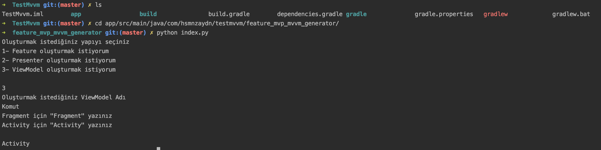

  Bunu yaptıktan sonra **ui** klasörünün içinde viewmodeliniz ve viewınız oluşacak

  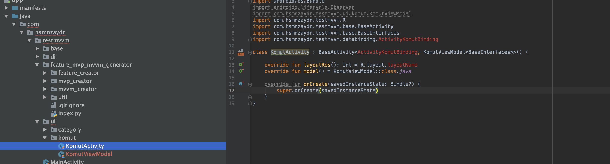

   #### Not: Eğer activity oluşturmuş iseniz MANIFEST dosyasına Activity'inizin ismini vermeyi unutmayınız

 #### Not2: layout id yi verip projeyi birkez rebuild ediniz


 Sadece bununla bitmiyor Presenter oluştururken yaptığı işlemleri **ViewModel** içinde yapıyor.
 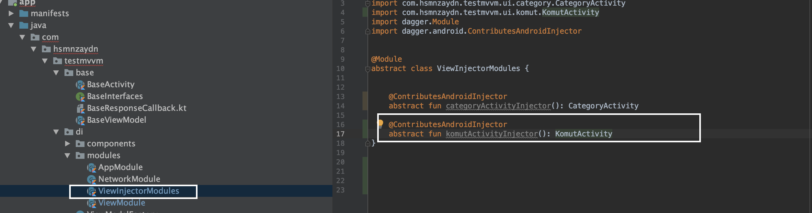
 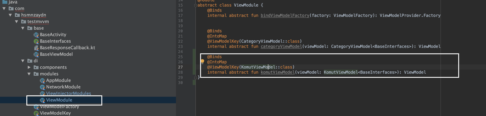