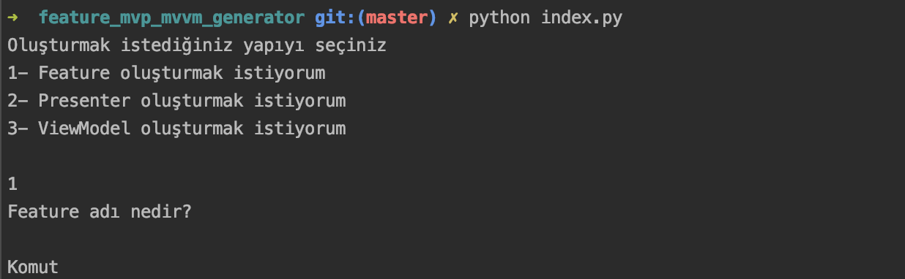
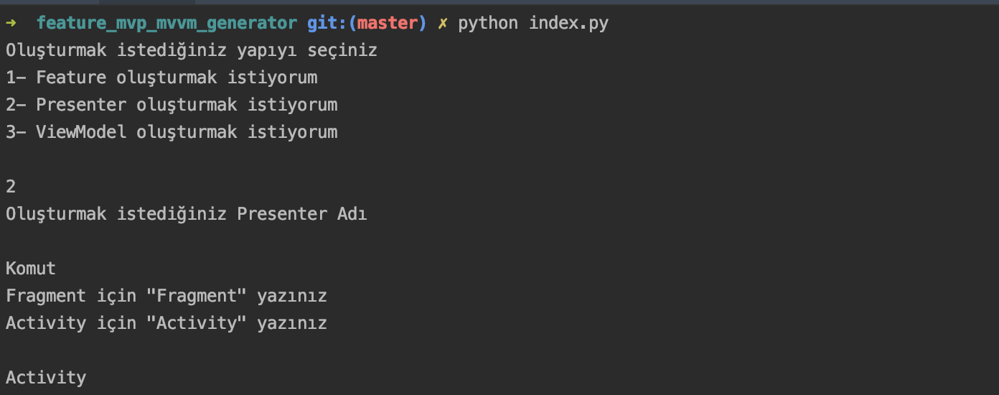
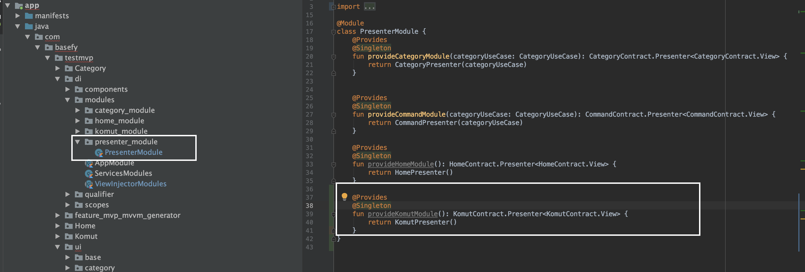
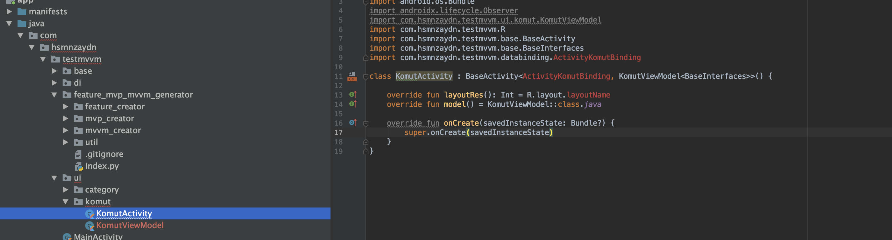
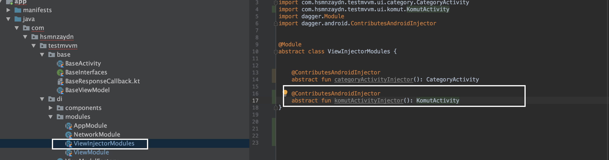
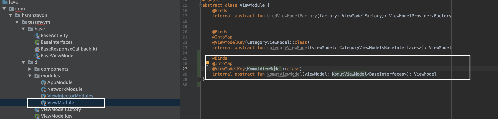

# Creator Feature, ViewViewModel and ViewPresenter 

### Motivation
When you are developing an application you want create a beautiful an architecture and compatible best practices. But if you have to create multiple layer for this. If you are working at dynamic company you have not time for create every time those layers you have to quickly get release. I decided fix this problem for this developed a python script.

### Why Python?
It is compatible with MacOs and Linux

### Dependencies

- Python 3.6 above

## Warning
It behaves based on file names. If you want use this script you have to use architecture of **TestMvp** and **TestMVVM** in repo.

# Use

You have to move script ([feature_mvp_mvvm_generator](https://github.com/hsmnzaydn/android-clean-feature-creator/tree/master/feature_mvp_mvvm_generator  "feature_mvp_mvvm_generator")) to root folder of project.

After this change variable of **basePackage** in **index.py** with your project package name.

## . Create A Feature

Write this command ``` python index.py ``` to terminal. And select choose as "1". After this terminal wait an input from you. You can write your feature name 

When do this created new folders in your project by script
- Created **feature** folder in your root folder 
- Created a module folder in your **modules** folder 
- Now you have to feature module(**KomutModule.kt**) class add to your **Componente** class 

## . Create A Presenter 

Write this command ``` python index.py ``` to terminal. And select choose as "2". After this terminal wait an input from you. You can write your presenter name 

When do this created new folders in your project by script
- Created presenter folders in your **ui** folder 
- Created activity, contract and presenter by script you are only give layout name to **xmlName** 

 After this script bindes your **presenter** file to Dagger 2  


 


 ## . Create A ViewModel 


Write this command ``` python index.py ``` to terminal. And select choose as "3". After this terminal wait an input from you. You can write your viewmodel name. And after this you can select view type(activity or fragment). If you want create a fragment only write 'fragment' 

 After this create folder under **ui** folder your viewmodel and view.   


 
 